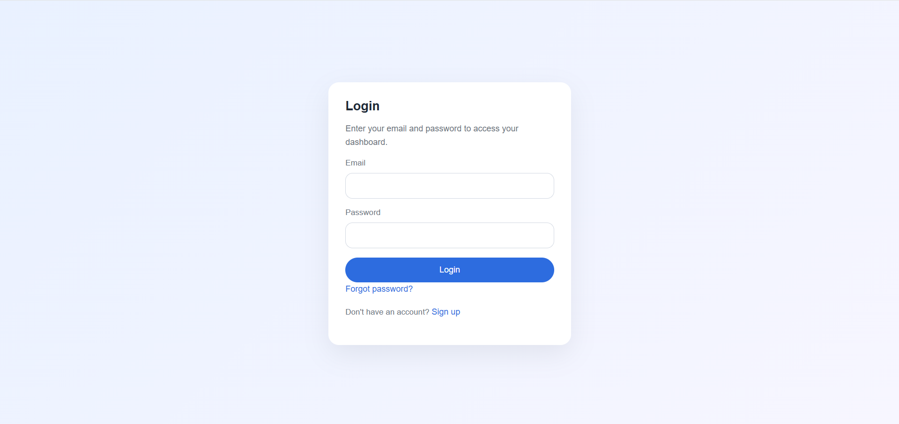
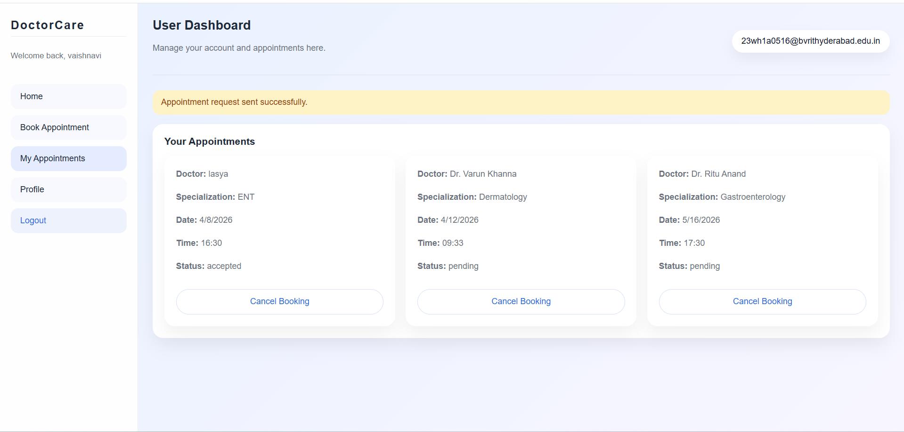
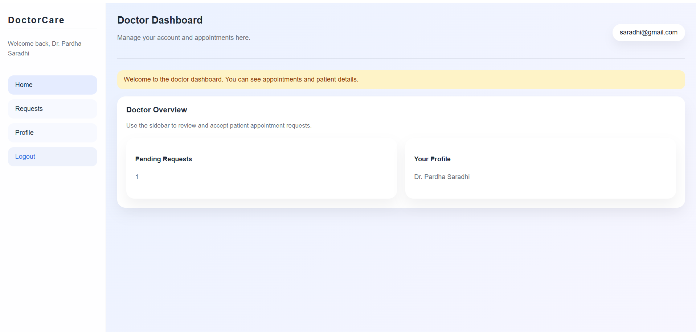
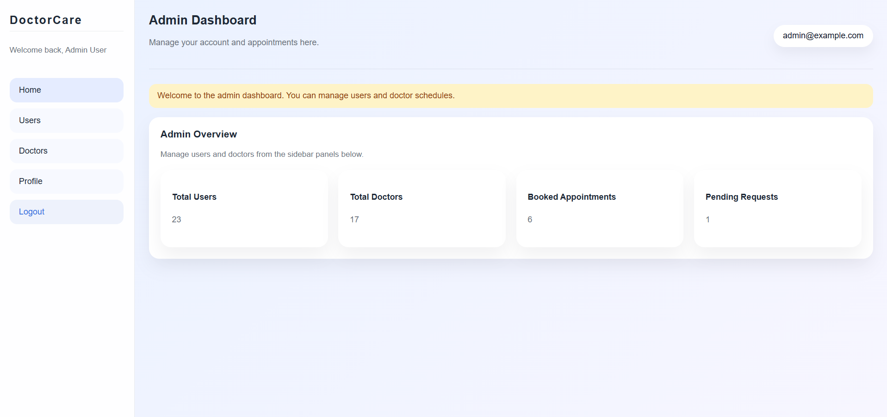
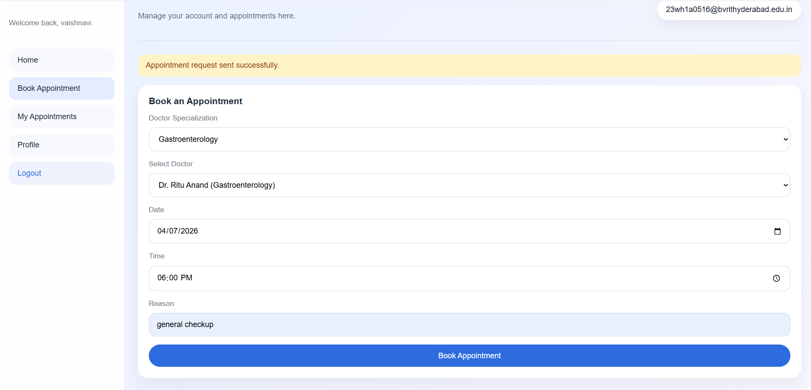

# 🏥 Doctor Appointment Booking System

A full-stack **Doctor Appointment Management System** built using the **MERN Stack (MongoDB, Express.js, React.js, Node.js)** to digitize and streamline appointment scheduling between patients and doctors.

The system supports **Patients, Doctors, and Admins** through secure authentication, role-based access control, appointment booking, schedule management, and appointment status tracking.

---

## 🎥 Demo Video

[Click here to watch demo](https://drive.google.com/file/d/1V0oWSDx3j7YRWtmgxdov2n8dRqx_eUVa/view?usp=sharing)

---

## 🚀 Features

### 👤 Patient Module
- Register and login securely  
- Browse available doctors  
- Book appointments  
- View appointment history  
- Cancel appointments  
- Track appointment status  

### 🩺 Doctor Module
- Secure doctor login  
- Manage availability and schedules  
- View assigned appointments  
- Approve or reject requests  
- Mark appointments as completed  

### 🛠️ Admin Module
- Add and manage doctors  
- View registered users  
- Monitor appointments  
- Manage platform operations  

---

## 🔐 Authentication & Security
- JWT Authentication  
- Role-Based Authorization (Patient / Doctor / Admin)  
- Protected Routes  
- Secure Password Handling  
- Middleware-based Access Control  

---

## 🧰 Tech Stack

### Frontend
- React.js  
- React Router  
- Axios  

### UI
- Bootstrap / Material UI / Tailwind CSS  

### Backend
- Node.js  
- Express.js  

### Database
- MongoDB  
- Mongoose ODM  

### API
- RESTful APIs  

---

## 📌 Core Functionalities Implemented
- User authentication and authorization  
- Doctor availability management  
- Appointment booking workflow  
- Appointment approval/rejection process  
- Appointment status tracking  
- Conflict prevention during scheduling  
- Form validation  
- Error handling middleware  

---

## 📂 Project Structure

```bash
Doctor-Appointment-Booking-System/
│
├── frontend/
│   ├── src/
│   │   ├── components/
│   │   ├── pages/
│   │   ├── context/
│   │   └── services/
│
├── backend/
│   ├── models/
│   ├── routes/
│   │   ├── adminRoutes.js
│   │   ├── appointmentRoutes.js
│   │   ├── authRoutes.js
│   │   └── dashboardRoutes.js
│   ├── controllers/
│   ├── middleware/
│   └── config/
│
├── Screenshots/
├── package.json
└── README.md
```

---

## 🗄️ Database Schema

### User Collection
```js
{
 name,
 email,
 password,
 role
}
```

### Doctor Collection
```js
{
 userId,
 specialization,
 availability,
 experience
}
```

### Appointment Collection
```js
{
 patientId,
 doctorId,
 date,
 time,
 status
}
```

---

## ⚙️ Installation and Setup

### Clone Repository

```bash
git clone https://github.com/23wh1a0516/Doctor-Appointment-Booking-System.git

cd Doctor-Appointment-Booking-System
```

---

### Install Dependencies

Backend:
```bash
cd backend
npm install
```

Frontend:
```bash
cd frontend
npm install
```

---

## 🔑 Environment Variables

Create `.env` file in backend:

```env
PORT=5000
MONGO_URI=your_mongodb_connection
JWT_SECRET=your_secret_key
```

---

## ▶️ Run the Project

Backend:
```bash
cd backend
npm run dev
```

Frontend:
```bash
cd frontend
npm start
```

---

## 🌐 System Workflow

1. Patient registers and logs in  
2. Patient views available doctors  
3. Patient books appointment  
4. Doctor reviews request  
5. Doctor approves or rejects appointment  
6. Patient tracks appointment status  

---

## 📸 Screenshots

### Login Page


### Patient Dashboard


### Doctor Dashboard


### Admin Dashboard


### Appointment Booking


---

## 📌 API Endpoints

### Authentication Routes (`authRoutes.js`)
```http
POST /api/auth/register
POST /api/auth/login
GET  /api/auth/profile
```

---

### Appointment Routes (`appointmentRoutes.js`)
```http
POST   /api/appointments/book
GET    /api/appointments
GET    /api/appointments/:id
PUT    /api/appointments/:id
DELETE /api/appointments/:id
```

---

### Admin Routes (`adminRoutes.js`)
```http
GET    /api/admin/doctors
POST   /api/admin/doctors
PUT    /api/admin/doctors/:id
DELETE /api/admin/doctors/:id

GET    /api/admin/users
GET    /api/admin/appointments
```

---

### Dashboard Routes (`dashboardRoutes.js`)
```http
GET /api/dashboard/patient
GET /api/dashboard/doctor
GET /api/dashboard/admin
```

---

## 🧱 Backend Architecture

### Models
- User Model  
- Doctor Model  
- Appointment Model  

### Controllers
- Authentication Controller  
- Doctor Controller  
- Appointment Controller  
- Dashboard Controller  

### Middleware
- Auth Middleware  
- Role Authorization Middleware  
- Error Handling Middleware  

### Routes
- Auth Routes (`authRoutes.js`)  
- Appointment Routes (`appointmentRoutes.js`)  
- Admin Routes (`adminRoutes.js`)  
- Dashboard Routes (`dashboardRoutes.js`)  

---

## 🎯 Advantages
✔ Prevents appointment conflicts  
✔ Reduces manual scheduling  
✔ Saves time for patients and doctors  
✔ Improves hospital efficiency  
✔ Scalable architecture  
✔ Real-world MERN implementation  

---

## ⚠ Challenges Addressed
- Handling appointment scheduling conflicts  
- Managing role-based access  
- Maintaining appointment workflow consistency  
- Designing scalable REST APIs  
- Securing authentication flows  

---

## ✨ Future Enhancements
- Email Notifications  
- SMS Alerts  
- Online Payments  
- Video Consultation  
- AI-based Doctor Recommendations  
- Mobile Application  

---

## 👩‍💻 Author

**Vaishnavi Chunduru**  
GitHub: https://github.com/23wh1a0516

---

## 📜 License
This project is developed for educational and academic purposes.
